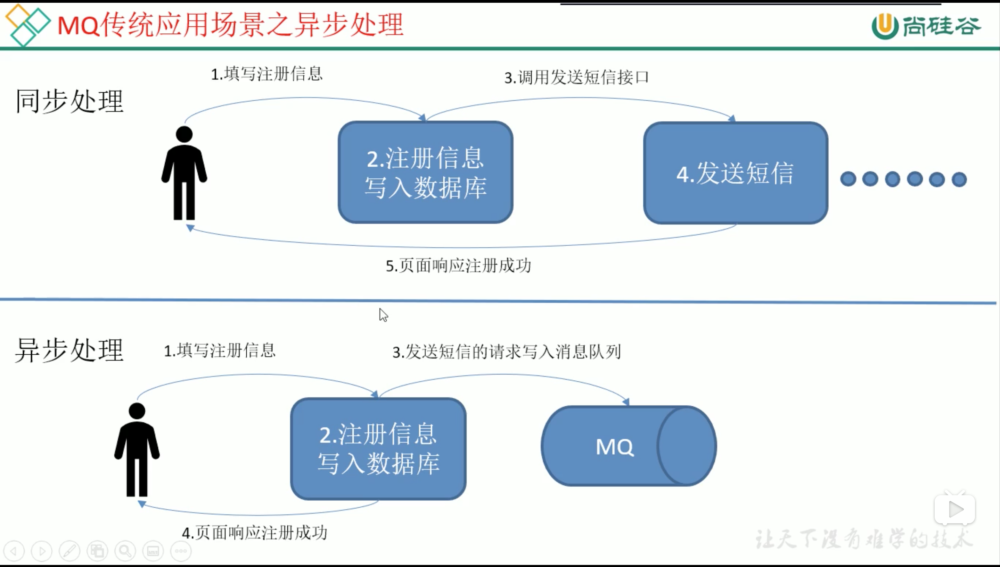

# 2. 消息队列

## 2.1 消息队列应用场景

## 2.2 消息队列的好处
* 解耦

允许独立的扩展或修改两边的处理过程，只要保证它们遵守同样的接口约束。

* 可恢复性

系统的一部分组件失效时，不会影响到整个系统。

消息队列降低了进程间的耦合度，所以即使一个处理消息的进程挂掉，加入队列中的消息仍然可以在系统恢复后被处理。

* 缓冲

有助于控制和优化数据流经过系统的速度，解决生产消息和消费消息的处理速度不一致的情况。

* 灵活性 & 峰值处理

在访问量剧增的情况下，应用仍然需要继续发挥作用，但是这样的突发流量并不常见。如果为以能处理峰值访问为标准来投入资源随时待命无疑是巨大的浪费。

使用消息队列能够使关键组件顶住突发的访问压力，而不会因为突发的超负荷的请求而完全崩溃。

