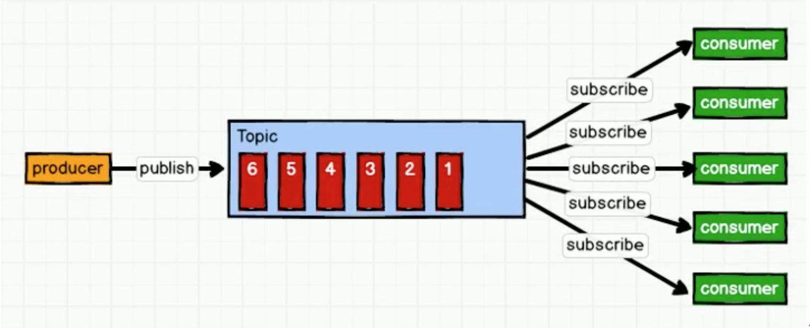

# 3. 消息队列2种模式

## 3.1 消息队列分类

消息队列分为2种模式:
* 点对点模式

* 发布/订阅模式

## 3.2 点对点模式

点对点: 1对1、消费者主动拉取数据，消息收到后消息清除。

### 流程
* 消息生产者生产消息发送到 queue 中
* 然后消息消费者从 queue 中取出并且消费消息
* 消息被消费后，queue 中不再有存储，所以消息消费者不可能消费到已经被消费的消息

`注意`: queue 支持存在多个消费者，但是对一个消息而言，只会有1个消费者可以消费。

## 3.3 发布/订阅模式

发布/订阅模式: 1对多，消费者消费数据之后不会清楚消息。

### 流程
* 消息生产者(发布)将消息发布到 topic 中
* 同时有多个消息消费者(订阅)消费该消息

### 发布/订阅 vs 点对点
* 点对点模式: 消息只可以被1个消费者消费
* 发布/订阅模式: 发布到 topic 的消息会被所有订阅者消费

### 发布/订阅分类

由 producer 到 consumer 消费 又可以分为2种:

* consumer 主动从 queue 拉取消息(Kafka)
    * 优点: 消费者的消费速度，可以由消费者自己来决定
    * 缺点: 需要维护长轮询，浪费资源 
* queue 主动推送消息到 consumer

