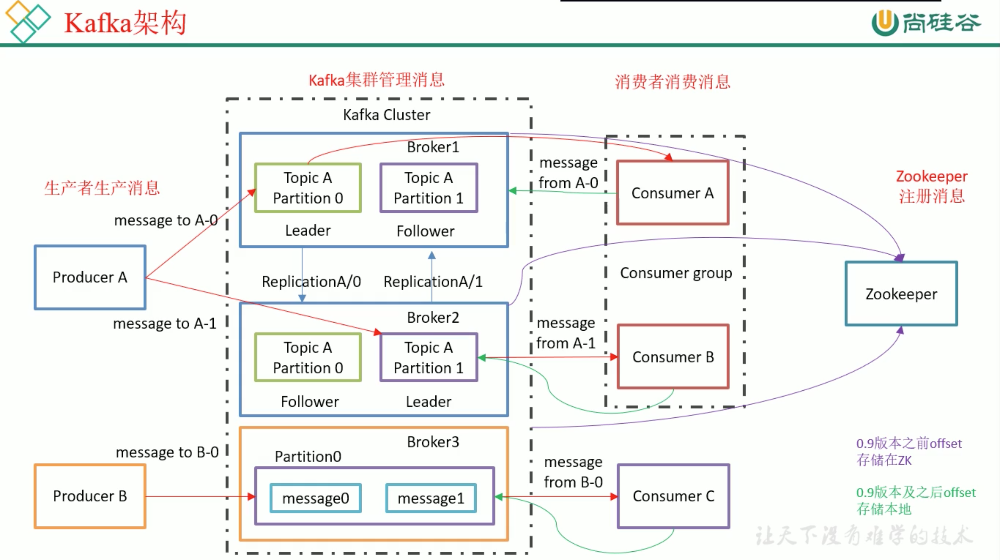

# 4. kafka 基础架构

## 4.1 kafka 架构图

## 4.2 kafka 中各部分

### Producer

Producer: 消息生产者，向 kafka broker 发送消息的客户端

### Consumer

Consumer: 消息消费者，向 kafka broker 取消息的客户端

### Consumer Group
Consumer Group: 消费者组，由多个consumer组成。
* 消费者组内每个消费者负责消费不同分区的数据
* 1个分区只能由同一个组内的1个消费者消费
* 消费组之间互不影响

所有的消费者都属于某个消费组，即消费者组是逻辑上的一个订阅者。

### Broker

Broker: 一台kafka服务器就是一个broker

一个集群由多个 broker 组成，一个 broker 可以容纳多个 topic。

### Topic

Topic: 可以理解为1个队列

生产者 和 消费者 面向的都是1个 topic

### Partition

Partition: 为了实现扩展性，一个非常大的 topic 可以分布到多个 broker (即服务器) 上

1个topic可以分为多个 partition，每个 partition 是1个有序的队列。

### Replica

Replica: 副本

为保证集群中的某个节点发生故障时，该节点上的 partition 数据不丢失，且 kafka 仍然能够继续工作，kafka 提供了副本机制，1个topic的每个分区都有若干副本，1个 leader 和若干个 follower。
 
### Leader

Leader: 每个分区多个副本的 "主"

生产者发送数据的对象，以及消费者消费数据的对象都是leader

### Follower

Follower: 每个分区多个副本中的 "从"

实时从 leader 中同步数据，保持和 leader 数据的同步。leader发生故障时，某个follower 会成为新的 leader。
