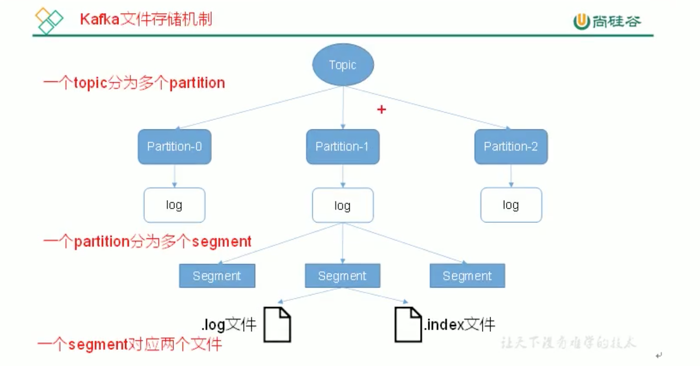

# 1. kafka 文件存储机制



## 1.1 topic

### 定义

kafka的生产者生产消息 和 消费者消费消息 面对的对象都是 topic，每个topic可以有多个 **分区** 和 **副本**。

在kafka集群中，每个broker（一个kafka实例称为一个broker）中有多个topic，topic数量可以自己设定。

`注意`: topic是物理上的逻辑概念，没有文件夹。

### 配置

* 默认每个topic分区数: num.partitions

每个topic的分区个数，更多的partition会产生更多的segment file
```
num.partitions=2
```

* 是否允许自动创建topic: auto.create.topics.enable

是否允许自动创建topic ，若是false，就需要通过命令创建topic
```
auto.create.topics.enable =true
```

* 默认分区副本数: default.replication.factor

一个topic ，默认分区的replication个数 ，不能大于集群中broker的个数。

```
default.replication.factor =1
```


## 1.2 Partition

### 定义

同一个topic下有多个不同的partition，每个partition为一个目录。

### 命名规则

Partition命名规则: topic名称 + 序号，序号从0开始。

如，mytopic 这个 topic有3个分区，则其对应的文件的文件夹为 mytopic-0、mytopic-1、mytopic-2

### 配置

Partition是物理上的概念，Partition文件的目录在 server.properties 中配置:

`注意`: 一般默认为 logs，但是最好将其和logs文件分开，做到数据和日志分离。

```
# server.properties文件中
log.dirs=kafka安装目录/data

# 多个地址的话用逗号分割
log.dirs=kafka安装目录/kafka-logs-1，kafka安装目录/kafka-logs-2
```


## 1.3 Segment File

由于生产者生产的消息会不断追加到 log 文件末尾，且每条数据都有自己的offset。

为防止 log文件过大导致数据定位效率低下，kafka采取了 **分片** 和 **索引**机制，将每个 partition 分为多个 segment。


### 定义

Segment File在 topic的Partition下，每个 Segment File由一对 .index索引文件 和 .log数据文件组成，被称为一个段。


`注意`: 每个段消息数量不一定相等，这种特性能够使得老的segment可以被快速清除。

> .timeindex文件。（0.8版本之前的kafka没有timeindex文件）, 是kafka的具体时间日志

### 命名规则

partion全局的第一个segment从0开始，后续每个segment文件名为上一个segment文件最后一条消息的offset值。

数值最大为64位long大小，19位数字字符长度，没有数字用0填充。

**查看 mytopic0分区下的文件**

```shell script
[root@www mytopic-0]# ll -lh
total 8.0K
-rw-r--r-- 1 root root  10M Nov  5 18:09 00000000000000000000.index
-rw-r--r-- 1 root root 2.6K Nov  8 22:22 00000000000000000000.log
-rw-r--r-- 1 root root  10M Nov  5 18:09 00000000000000000000.timeindex
-rw-r--r-- 1 root root    8 Nov  5 18:09 leader-epoch-checkpoint
```

### 配置

Partition文件的目录在 server.properties 中配置:

* 文件大小: log.segment.bytes

Segment File默认大小为 1G，每满500兆就会创建新的segment段。-1表示没有限制。

设置参数如下:

```
# server.properties文件中

# The maximum size of a log segment file. When this size is reached a new log segment will be created.
log.segment.bytes=1073741824
```

* 保存最长时间: log.retention.hours

Segment File默认保存最长时间为 7天，超过7天会被清理 log文件和index文件:

设置参数如下:

```
# server.properties文件中

# The minimum age of a log file to be eligible for deletion due to age
log.retention.hours=168
```

* 超过时间新建segment: log.roll.hours

当达到下面时间，会强制新建一个segment:

```
log.roll.hours = 24*7
```
