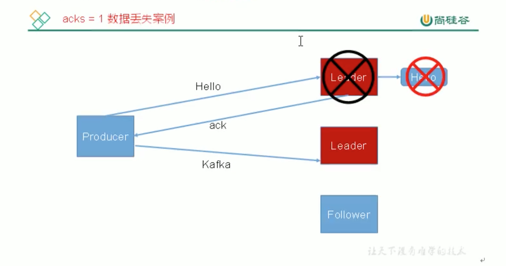
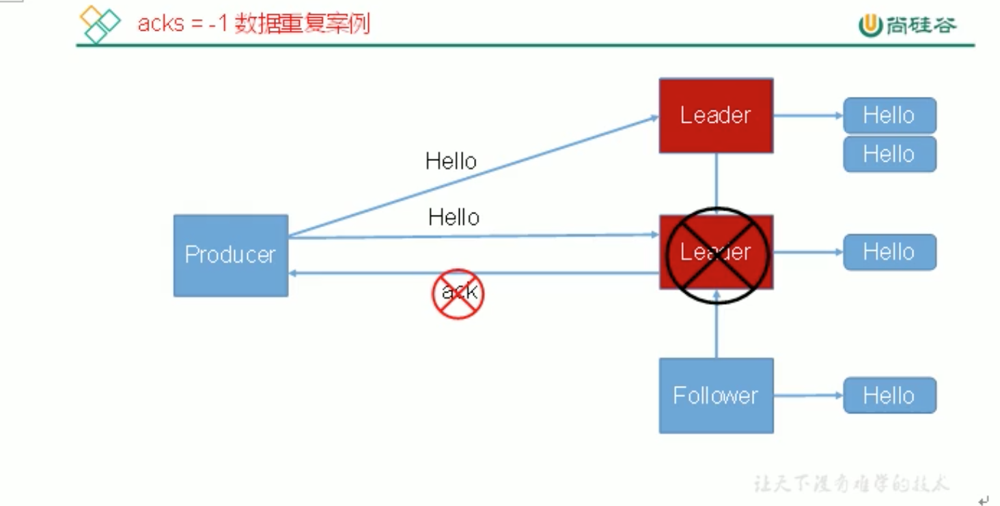

# 2. 数据可靠性保证

## 2.1 生产者发送消息

为保证 producer 发送的数据，能可靠的发送到指定的 topic:
* topic的每个partition收到 producer发送的数据后，都需要向 producer发送 ack
* 如果 producer收到ack，就会进行下一轮的发送，否则重新发送数据

## 2.2 生产者 ack机制

kafka为用户提供了3种可靠级别，用户根据对可靠性和延迟的要求进行权衡，选择以下的配置

#### acks=0: producer不等待 broker的ack

`注意`: acks=0，最容易丢失数据。

这一操作提供了1个最低的延迟，broker一接收到还没写入磁盘就已经返回，当broker故障时有可能丢失数据。

#### acks=1: producer等待broker的ack，但不等待ISR中follower同步完成

partition的leader落盘成功后返回ack，如果在follower同步成功之前leader故障，那么将会丢失数据。

#### acks=-1(all): producer等待broker的ack，partition的leader和 ISR中follower全部落盘成功后才返回ack

但是如果在follower同步完成后，broker发送ack之前，leader发生故障，那么会造成数据重复。

`极限情况`: ISR中没有follower，当leader落盘成功后，就返回ack，和acks=1情况一致，也容易丢数据。
